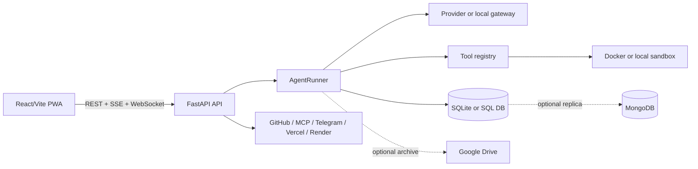

# Rawal AI Architecture

Rawal AI is a two-process application in production Docker deployments: the public FastAPI application and an optional loopback-only model gateway. The web client communicates with the API over HTTPS, SSE, and WebSockets.

## Request lifecycle

A user message is accepted by the thread API and an in-memory run registry claims the thread before the asyncio task is scheduled. The runner loads thread history, project instructions, memories, and relevant skills. It calls the configured model, streams text and reasoning events, executes tool calls, persists messages, and emits a final run event. A second message during the run is treated as steering input rather than a competing run.

The event bus assigns sequence numbers to observable thread events. The browser reconnects with the last sequence number after a network interruption. Heartbeats keep idle SSE connections alive. Provider streams have a stall watchdog and bounded retries so a silent upstream cannot leave an eternal spinner.

## Trust boundaries

The browser is an untrusted client. Authentication is enforced by the API. Provider and integration secrets remain server-side. The sandbox is the execution boundary for agent-generated commands. The local backend rejects paths outside the configured workspace root. Docker is the preferred isolation layer when available.

## Persistence model

SQLite is the default local database. Files and workspaces live below `WORKSPACE_ROOT`. MongoDB is an optional durable replica/persistence layer for ephemeral hosts. Google Drive archives are optional workspace snapshots. The application can continue in a degraded mode when optional integrations are unavailable.

## Scaling constraints

The default process is designed for a single service instance because the in-memory event bus and run registry are process-local. For multiple replicas, introduce a shared event bus and distributed run lock before scaling horizontally. Render Free is suitable for personal or low-volume use with MongoDB persistence; it is not a substitute for a multi-worker production architecture.

## References

[1]: https://fastapi.tiangolo.com/advanced/websockets/ "FastAPI WebSockets"
[2]: https://developer.mozilla.org/en-US/docs/Web/API/Server-sent_events "MDN Server-sent events"
[3]: https://docs.docker.com/engine/security/ "Docker Engine security"
